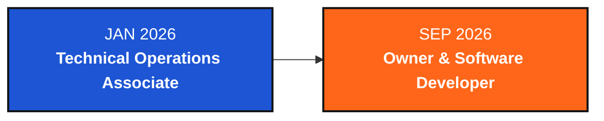

<div align="center">


<br><br>


<a href="https://www.srivasavidigitalservice.tech/">
  
</a>

</div>

<br>

## About Me

<table>
<tr>
<td width="60%" valign="top">

I'm **Vignesh S**, a second-year **Computer Science Engineering student at G. Pulla Reddy Engineering College, Kurnool**.

I learn better when I build something with what I'm studying.

Most of my time goes into programming, web development, small projects, and digital work through **Sri Vasavi Digital Services**.

I'm still early in the process, so I spend a lot of time understanding the basics, trying things out, debugging, and improving what I build.

</td>

<td width="40%" align="center" valign="middle">


<br><br>

```text
$ ./vignesh.sh

LEARN
BUILD
BREAK
DEBUG
UNDERSTAND

STATUS
STILL_BUILDING
````

</td>
</tr>
</table>

<br>

## What I Use

<div align="center">


</div>

<br>

## Things I've Built

<div align="center">

<table>
<tr>

<td width="340" align="center" valign="top">


<h3>NEON RUNNER</h3>

A small cyberpunk style game built while learning programming and frontend development.

<br><br>


</td>

<td width="340" align="center" valign="top">


<h3>Student Record Management System</h3>

A console based C project for managing student records.

<br><br>


</td>

</tr>
</table>

</div>

<br>

## How I Learn

<div align="center">


&nbsp;&nbsp;

&nbsp;&nbsp;

&nbsp;&nbsp;

&nbsp;&nbsp;


<br><br>

`LEARN` → `BUILD` → `BREAK` → `DEBUG` → `UNDERSTAND` → `BUILD AGAIN`

</div>

<p align="center">
I learn better when I can put a concept into a project and see where it breaks.
</p>

<br>

## The SVDS Timeline



I started at **Sri Vasavi Digital Services** working with requirements, follow ups, outreach, and project coordination.

Later, I moved into the **Owner & Software Developer** role and began handling the development work as well.

<br>

<div align="center">

<a href="https://vigneshcdx.github.io/VigneshCdx/">

</a>
<a href="https://github.com/VigneshCdx">

</a>
<a href="https://www.linkedin.com/in/vignesh-somapuram/">

</a>
<a href="https://www.instagram.com/vigneshcdx/">

</a>

</div>

<br>

<div align="center">


</div>
